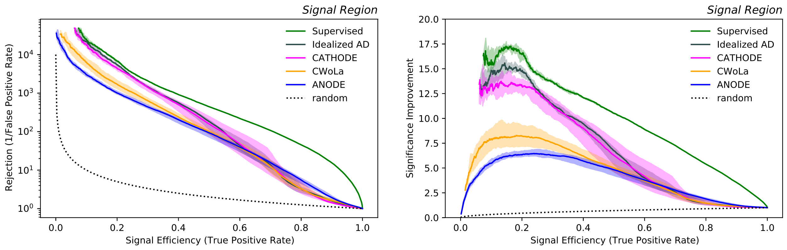

# CATHODE

A new anomaly detection algorithm that brings together the best from ANODE and CWoLa. Train a density estimator on sidebands, sample artificial datapoints in the signal region, train a classifier to distinguish artificial and real signal region data and then use the same classifier for classifying signal (the anomaly) from background. 

To see the definition of signal region and sideband region please see: [SB-SR](SB-SR.pdf)



Follow the instructions below to reproduce the results and/or perform further studies. The steps "Train the ANODE model", "Mix data and samples", "Train the classifier", and "Evaluation" can be called separately as described below. Alternatively, the script `run_all.py` can be used to run the full pipeline in one call.

## Citation
If you use **CATHODE** for your research, please cite:  
- *"Classifying Anomalies THrough Outer Density Estimation (CATHODE)"*,  
By Anna Hallin, Joshua Isaacson, Gregor Kasieczka, Claudius Krause, Benjamin Nachman,
Tobias Quadfasel, Matthias Schlaffer, David Shih, and Manuel Sommerhalder. <br>
[arXiv:2109.00546](https://arxiv.org/abs/2109.00546). 

## Data preparation
(can be skipped if one starts directly from the preprocessed samples here)

To get the datasets:
```
wget https://zenodo.org/record/4536377/files/events_anomalydetection_v2.features.h5
wget https://zenodo.org/record/5759087/files/events_anomalydetection_qcd_extra_inneronly_features.h5
```

To preprocess:
```
python run_data_preparation_LHCORD.py
```
To scan over different signal injections and/or different splits, use the `--S_over_B` and `--seed` option respectively. The results in the paper when scanning into lower S/B ratios were achieved by varying the seed from 1 to 10.

## Running the full pipeline

Use the script `run_all.py` to run the full pipeline in one go. The flag `--mode` with the options `CATHODE`, `ANODE`, `CWoLa`, or `supervised` specifies which analysis type will be run. Explanation of additional arguments are explained when calling `python run_all.py -h`. In general, arguments considering the density estimator step start with `--DE_`, and arguments considering the classifier step start with `--cf_`.

The command to produce the most up-to-date performance is:
```
python run_all.py --data_dir separated_data/ --mode CATHODE --cf_separate_val_set --no_extra_signal --cf_n_samples 400000 --cf_realistic_conditional --cf_oversampling --cf_no_logit --cf_use_class_weights --cf_save_model --cf_n_runs 1
```

## Train the ANODE model

The corresponding script is run_ANODE_training.py

## Mix data and samples

The corresponding script is run_classifier_data_creation.py

## Train the classifier

The corresponding script is run_classifier_training.py

## Evaluation

The evaluation leading to the main plots is shown in plotting_notebook.ipynb.

Alternatively, a short script like
```
from evaluation_utils import full_single_evaluation

data_savedir = 'classifier_data_folder/'
preds_dir = 'classifier_output_folder/'

_ = full_single_evaluation(data_savedir, preds_dir, n_ensemble_epochs=10, sic_range=(0, 20), savefig='result_SIC')
```

will plot the resulting SIC curve to file.


## Benchmarks

### Classic ANODE

The most up-to-date command for the ANODE benchmark is:
```
python run_all.py --no_extra_signal --data_dir separated_data/ --mode ANODE
```

### CWoLa

The most up-to-date command for the CWoLa Hunting benchmark is:
```
python run_all.py --data_dir separated_data/ --mode CWoLa --cf_separate_val_set --no_extra_signal --cf_oversampling --cf_no_logit --cf_use_class_weights --cf_save_model
```

### Idealized AD

The most up-to-date command for the idealized anomaly detector benchmark is:
```
python run_all.py --data_dir separated_data/ --mode idealized_AD --cf_separate_val_set --no_extra_signal --cf_no_logit --cf_oversampling --cf_use_class_weights --cf_save_model --cf_extra_bkg
```

### Supervised

The most up-to-date command for the fully supervised benchmark is:
```
python run_all.py --data_dir separated_data/ --mode supervised --cf_separate_val_set --no_extra_signal --cf_no_logit --cf_oversampling --cf_save_model --cf_extra_bkg
```

## Side remarks

All the listed scripts provide documentation on how to use them by calling `python [SCRIPT].py --help`. In particular, the above example commands use default input/output directories and model names, which should be adjusted to custom choices when multiple studies are performed.

